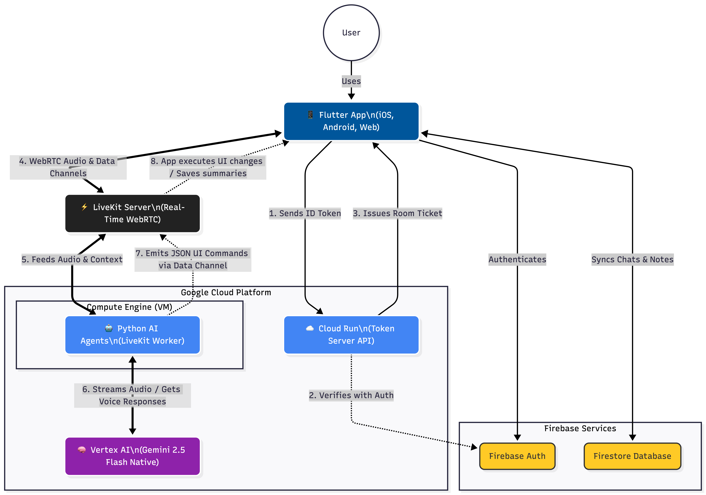

# 🚀 Chatboom: AI-Native Communication Platform

## 📖 Introduction
Chatboom is a modern, real-time messaging application augmented with deep Artificial Intelligence integrations. Instead of just bolting an AI chatbot onto a messaging app, Chatboom introduces AI as an active participant in your daily workflows. 

**Core Features:**
* **The AI Answering Machine:** If you are unavailable, your personalized Voice AI (powered by Gemini) answers calls from your friends, speaks to them naturally, reads the context of your recent chats to understand the relationship, and takes smart summaries (Notes) for you to review later.
* **The In-App Voice Copilot:** A globally accessible voice assistant that navigates the app for you. You can tell it to "Open my chat with Sarah," "Draft a message saying I'll be late," or even have it generate and quiz you on interactive Flashcards in a dedicated Study Mode. 
* **Cross-Platform:** Beautiful, responsive UI built in Flutter, ready for Web, Android, and iOS.

---

## 🧠 How It Works (The Architecture)

To understand how to deploy this, it helps to see how the frontend, the real-time voice infrastructure, and the AI models communicate.



1.  **The Frontend (Flutter):** The app users install. It handles UI, Firebase Authentication, and direct messaging via Firestore. When a user wants to talk to an AI, the app requests a "ticket" to join a secure voice room.
2.  **The Token Server (Python/Flask):** A lightweight API hosted on Cloud Run. The app sends its secure Firebase ID token here. The server verifies the user, generates a secure WebRTC ticket using LiveKit, and sends it back. 
... [rest of the section continues here]


To understand how to deploy this, it helps to understand how the pieces talk to each other:

1.  **The Frontend (Flutter):** The app users install. It handles UI, Firebase Authentication, and direct messaging via Firestore. When a user wants to talk to an AI (either the Answering Machine or the Copilot), the app requests a "ticket" to join a secure voice room.
2.  **The Token Server (Python/Flask):** A lightweight API. The app sends its secure Firebase ID token here. The server verifies the user, generates a secure WebRTC ticket using LiveKit, and sends it back. 
3.  **The Real-Time Voice Infrastructure (LiveKit):** The bridge. It handles the ultra-low-latency audio routing between the user's phone and the AI brain.
4.  **The AI Agents (Python/LiveKit Agents):** Two continuous background workers (`agent.py` and `app_agent.py`). They sit in LiveKit waiting for users to connect. When a user speaks, the audio is routed directly to Google's **Vertex AI (Gemini 2.5 Flash Native Audio)**, which processes the voice and speaks back in real-time, occasionally sending JSON commands back to the Flutter app to change the UI.

---

## 🛠️ Deployment Guide

Follow these steps in order. Do not skip ahead, as each phase relies on the previous one.

### Phase 1: Firebase & Google Cloud Setup
First, we need the database, authentication, and the AI brain enabled.

1.  **Create a Firebase Project:** Go to the [Firebase Console](https://console.firebase.google.com/) and create a new project. 
2.  **Enable Services in Firebase:**
    * **Authentication:** Enable Email/Password and Google Sign-In.
    * **Firestore Database:** Create the database (Start in production mode, but ensure your security rules eventually allow authenticated users to read/write).
    * **Storage:** Enable Firebase Storage (used for profile pictures).
3.  **Connect Flutter to Firebase:** Run `flutterfire configure` in your frontend directory to automatically generate your `firebase_options.dart` file.
4.  **Enable Vertex AI:**
    * Go to the [Google Cloud Console](https://console.cloud.google.com/) (using the same project Firebase created).
    * Search for **Vertex AI API** and click **Enable**.
5.  **Create a Service Account (For the AI Agents):**
    * In Google Cloud, go to IAM & Admin > Service Accounts.
    * Create a new Service Account. Grant it the **Vertex AI User** role and **Firebase Admin** role.
    * Click on the account > Keys > Add Key > Create New Key (JSON). 
    * Download this file and rename it to `key.json`. Keep it safe.

### Phase 2: LiveKit Setup
You need a server to handle the audio streams. The easiest way is LiveKit Cloud.

1.  Go to [LiveKit Cloud](https://cloud.livekit.io/) and create a free account/project.
2.  Navigate to your Project Settings > Keys.
3.  Generate a new API Key and Secret. 
4.  Note down your **WebSocket URL**, **API Key**, and **API Secret**.

### Phase 3: Deploying the Token Server (Cloud Run)
This is the Flask API (`server.py`) that issues tickets to the Flutter app. Cloud Run is perfect for this because it scales automatically based on HTTP requests.

1.  **Prepare the Environment:** In your backend folder, ensure you have the `Dockerfile` (the one exposing port 8080) and `requirements.txt`.
2.  **Set Environment Variables:** In the Google Cloud Console, navigate to **Cloud Run** and click "Deploy Container" (or use the `gcloud` CLI). You must inject these environment variables into the Cloud Run service:
    * `LIVEKIT_URL`: Your LiveKit WebSocket URL.
    * `LIVEKIT_API_KEY`: Your LiveKit Key.
    * `LIVEKIT_API_SECRET`: Your LiveKit Secret.
3.  **Deploy:** Deploy the container. Once finished, Cloud Run will give you a public URL (e.g., `https://chatboom-server-xyz.run.app`).
4.  **CRITICAL STEP:** Open your Flutter code. In `voice_service.dart` and `app_copilot_service.dart`, find the `_tokenServerUrl` variable and replace the hardcoded URL with your new Cloud Run URL.

### Phase 4: Deploying the AI Agents (Compute Engine VM)
Unlike the Flask server, LiveKit agents require continuous, long-running processes that listen for events. Cloud Run will put them to sleep, so you must run these on a Virtual Machine (VM).

1.  **Spin up a VM:** In Google Cloud Console, go to **Compute Engine** > VM Instances. Create a basic Linux instance (e.g., e2-medium with Ubuntu).
2.  **Install Docker:** SSH into the VM and install Docker and Docker Compose.
3.  **Upload Files:** Upload your backend files to the VM (`agent.py`, `app_agent.py`, `study_tools.py`, `Dockerfile.agents`, `requirements_agents.txt`, `docker-compose.yml`, and the `key.json` file you downloaded earlier).
4.  **Configure `.env`:** On the VM, create a `.env` file in the same directory containing:
    ```env
    LIVEKIT_URL=your_livekit_url
    LIVEKIT_API_KEY=your_livekit_key
    LIVEKIT_API_SECRET=your_livekit_secret
    GOOGLE_CLOUD_PROJECT=your_gcp_project_id
    GOOGLE_CLOUD_LOCATION=us-central1
    ```
5.  **Run the Agents:** Execute the following command:
    ```bash
    docker-compose up -d
    ```
    *This will build the Python environment and start both the Answering Agent and the Copilot Agent in the background.*

### Phase 5: Compiling and Deploying the Frontend (Flutter)
Now that the brain and the servers are running, it's time to build the apps.

1.  **Install Dependencies:** Run `flutter pub get` in your terminal.
2.  **Environment Variables:** Create a `.env` file in your Flutter root directory if you have any frontend-specific secrets (as defined in `main.dart`).

**Deploying to Web (Firebase Hosting):**
1.  Initialize hosting: `firebase init hosting`
2.  Build the web app: `flutter build web --release`
3.  Deploy: `firebase deploy --only hosting`
4.  Your app is now live on the web!

**Deploying to Android:**
1.  Run `flutter build apk --release` (for direct sideloading) or `flutter build appbundle --release` (for the Google Play Store).
2.  The file will be located in `build/app/outputs/flutter-apk/`.

**Deploying to iOS:**
*Note: Requires a Mac and Xcode.*
1.  Run `cd ios && pod install && cd ..`
2.  Run `flutter build ipa`
3.  Open the `.xcworkspace` in Xcode, configure your Apple Developer signing certificates, and upload to App Store Connect or TestFlight.


## 🧪 Reproducible Testing Instructions

To properly test Chatboom's AI features, we recommend using two separate accounts (or two browser windows/devices) to simulate a real conversation.

### Prerequisites
1. Open the Live Web App URL (or clone the repo and run `flutter run -d chrome`).
2. Create two test accounts (e.g., User A and User B).

### Test Case 1: The AI Answering Machine
1. Log in as **User A**. Go to the `Profile` tab and toggle **"Enable AI Agent"** to ON. Set a custom prompt like: *"I am out grabbing coffee, please leave a message."*
2. Log in as **User B** on a different device or incognito window.
3. As User B, find User A in the `Chats` tab and open the chat.
4. Click the **"Call Agent"** button at the top of the screen. 
5. Wait for the connection, and speak to the AI! Notice how it uses the custom prompt.
6. Say goodbye and hang up. 
7. Switch back to **User A**, navigate to the `Notes` tab, and view the AI-generated summary of the call.

### Test Case 2: The UI Copilot
1. Log in to any account and click the floating **"My AI"** button on the bottom right.
2. Once the AI connects (the orb glows blue), speak naturally and say: *"Navigate to my profile."* Watch the app change tabs automatically.
3. Say: *"Open my chat with [Other User's Name]."* 4. Once the chat opens, say: *"Draft a message saying I will be 10 minutes late."*
5. The AI will type the message into the input box and ask you if it should send it!

### Test Case 3: AI Study Mode
1. Click the **"My AI"** button to summon the Copilot.
2. Say: *"Create a new study deck about the Solar System."*
3. The AI will automatically navigate to the Study tab, create the deck, and generate the flashcards.
4. Once generated, tell the AI to *"Flip the card"* or *"Go to the next card"* entirely hands-free.

